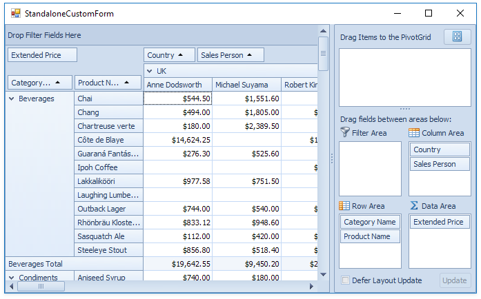

<!-- default badges list -->

<!-- default badges end -->

# WinForms Pivot Grid - Display the Customization Form near the Pivot Grid

This example demonstrates how to display the Customization Form near the Pivot Grid.

The form is located in the [SplitContainerControl](https://docs.devexpress.com/WindowsForms/DevExpress.XtraEditors.SplitContainerControl) - a parent container for the Pivot Grid and Customization Form. To specify the SplitContainer's panel as the Customization Form's owner, handle the [PivotGridControl.ShowingCustomizationForm](https://docs.devexpress.com/WindowsForms/DevExpress.XtraPivotGrid.PivotGridControl.ShowingCustomizationForm) event and use the [e.ParentControl](https://docs.devexpress.com/WindowsForms/DevExpress.XtraPivotGrid.CustomizationFormShowingEventArgs.ParentControl) property. 

Specify the form's appearance with the [PivotGridOptionsCustomization.CustomizationFormStyle](https://docs.devexpress.com/CoreLibraries/DevExpress.XtraPivotGrid.PivotGridOptionsCustomization.CustomizationFormStyle) property.

Call the [PivotGridControl.FieldsCustomization](https://docs.devexpress.com/WindowsForms/DevExpress.XtraPivotGrid.PivotGridControl.FieldsCustomization.overloads) method to show the form.

## Files to Review

[Form1.cs](./CS/StandaloneCustForm/Form1.cs) (VB: [Form1.vb](./VB/StandaloneCustForm/Form1.vb))

## Documentation

[Customization Form](https://docs.devexpress.com/WindowsForms/11785/controls-and-libraries/pivot-grid/layout/customization-form/customization-form-overview)

## More Examples 

[Pivot Grid for WinForms - How to Group Fields into Folders in the Customization Form](https://github.com/DevExpress-Examples/winforms-pivot-create-user-folders-within-the-customization-form)
